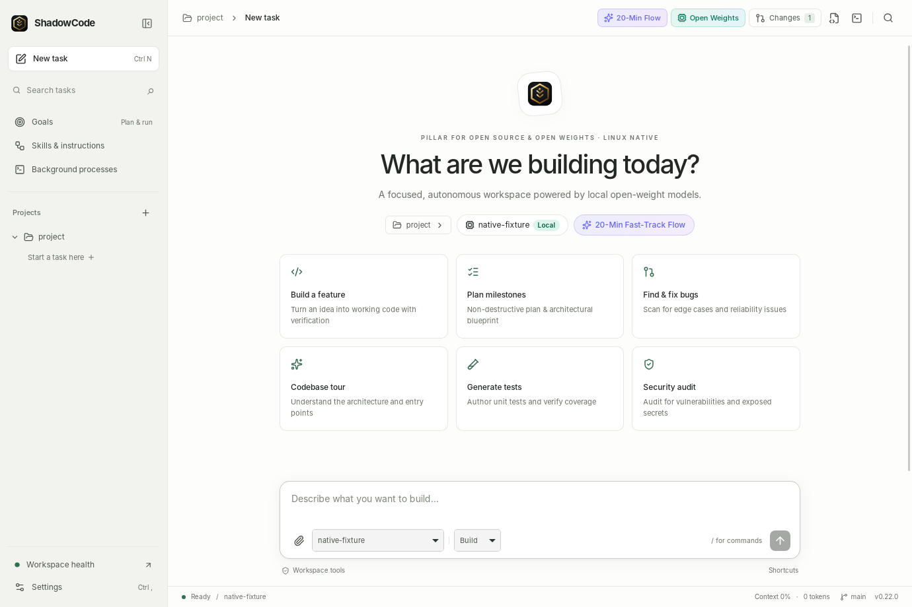

# ShadowCode

  

**Your ideas. Your models. Your machine.**

ShadowCode is a Linux coding-agent workspace inspired by the focused workflow of
Codex. Bring a local model or an OpenAI-compatible provider. The harness owns
context, tools, permissions, checkpoints, plans, and verification.



**Native 0.20 development:** the `native-0.20` branch now builds a Rust/Tauri
desktop window with the interface embedded in the executable. It needs no Python
runtime or browser launcher. See the [native development guide](docs/NATIVE_DESKTOP.md)
and [goals workflow](docs/NATIVE_GOALS.md). Development AppImage and Debian
packages include [dependency inventories and notices](licenses/native/README.md).
Integrations and release checks are
still in progress under the [migration gates](docs/NATIVE_MIGRATION.md);
0.19 remains the supported download below.

## Get the app

Download the **x86_64 AppImage** from the [latest release](https://github.com/ShadowfetchLinux/ShadowCode/releases/latest).
Python and the built interface are bundled; Node.js is not needed to run it.
The release targets **Ubuntu 24.04 or newer / glibc 2.39+**. Git and a browser
must be installed. Chromium, Chrome, or Brave opens a dedicated app window;
other desktop environments use their default browser.

```bash
chmod +x ShadowCode-0.19.0-x86_64.AppImage
./ShadowCode-0.19.0-x86_64.AppImage --appimage-extract-and-run
```

Extraction mode works without FUSE. To install into `~/Applications`, add a
stable `shadow` command, and replace the desktop launcher:

```bash
git clone https://github.com/ShadowfetchLinux/ShadowCode.git
cd ShadowCode
./scripts/install-appimage.sh /path/to/ShadowCode-0.19.0-x86_64.AppImage
```

Verify the download against the release's `SHA256SUMS` before installing.
The installer replaces older ShadowCode AppImages only after the new executable
passes its version check. It preserves settings, keys, memory, and task history.
A portable `.tar.gz` is also available; extract it and run `ShadowCode/shadowcode`.

## What's new in 0.19.0

- **A focused workspace.** Persistent projects and tasks, search, pinned tasks,
  a refined light/dark interface, and responsive layouts. Files, review, terminal,
  goals, and health stay beside the conversation.
- **A better conversation.** Markdown with code-copy controls, live tool cards,
  observable task plans, saved prompt drafts, and scroll position that respects
  reading older output. Keyboard-driven navigation and accessible dialogs.
- **Reliable continuation.** Reload reconnects to a running task. Stable event
  cursors prevent duplicate history and the old 800-event stream stall. Restarts
  mark unfinished jobs interrupted and expose a Continue action.
- **Context that follows the task.** Resuming switches the backend workspace;
  follow-ups and branches carry bounded prior conversation. Renamed tasks keep
  their names. Cancellation remains pending until the worker stops.
- **Review with evidence.** Untracked file previews, separate staged/unstaged
  views, literal filenames, and protection against stale hunk application.
- **A complete Linux release.** AppImage, portable archive, Python wheel, checksums,
  installation scripts, CI, and release automation. MCP is now a declared
  dependency, so a fresh install includes the advertised server.
- **A tighter local API.** Same-origin browser access, host validation, read-only
  enforcement for direct workspace edits, and guards against competing jobs
  or manual edits during a task.

See [CHANGELOG.md](CHANGELOG.md) for the release history and
[the user guide](docs/USER_GUIDE.md) for workflows and recovery.

## From source

Requires Python 3.12+ and Node.js 20.19+ or 22.12+.

```bash
git clone https://github.com/ShadowfetchLinux/ShadowCode.git
cd ShadowCode
./scripts/install-linux.sh
~/.local/bin/shadow ui
```

Dependencies live in the checkout's `.venv`; the installer does not uninstall
system Python packages. Re-run it after updating the checkout. Keep the checkout
in place while using a source installation.

## Choose a model

On first launch, select a detected local model and **Test & start**, or enter a
provider endpoint and model ID. Mock is an offline harness demonstration with
deterministic behaviors, not a general coding model.

```bash
shadow models
shadow models --use gpt-oss:20b
shadow models --use my-model --provider local --endpoint http://127.0.0.1:1234/v1
shadow models --use my-model --provider openai_compatible --endpoint https://your-provider.example/v1
```

Supported providers: Ollama, LM Studio/local, llama.cpp, vLLM, and any compatible
`/v1/chat/completions` endpoint. The composer can override the model per task.
Store API keys through Settings or the environment variable named by `api_key_env`.
Never put keys in YAML or Git.

## Workflows

- **Build:** describe a change, watch inspection and tool execution, review the
  resulting files, and inspect verification output.
- **Review:** open Review in the top bar. Stage a hunk or new file, inspect the
  staged diff, then commit with a message. Discarding a hunk asks first.
- **Continue:** select a task in the sidebar. Drafts and history return; running
  work reconnects. Branch, rename, export, or delete through Manage tasks in the
  command palette.
- **Goals:** create a milestone checklist and run/resume its tasks. Automatic
  completion reflects the harness verifier's checks, not a proof of correctness.
- **Inspect:** browse files or run a bounded command in the terminal panel.
  Long-running services belong in Background processes.

## Keyboard

`Ctrl+K` command palette · `Ctrl+B` sidebar · `Ctrl+N` new task · `Ctrl+P` open
project · `Ctrl+,` settings · `Ctrl+L` composer · `Ctrl+.` stop ·
`Ctrl+Shift+E` export · `?` help. `Enter` sends; `Shift+Enter` inserts a line.
Approval cards require their explicit Allow or Deny buttons.

## CLI and integrations

```bash
shadow tui                         # terminal UI
shadow run "Explain this workspace"
shadow run --json "Review this workspace"
shadow ui --no-browser             # loopback API + built interface
shadow sessions                    # task history
shadow export --format md
shadow goal "Improve test coverage" --run
shadow goals
shadow doctor
shadow update --check
shadow mcp serve                   # MCP over stdio
shadow mcp serve --http 127.0.0.1:7431
shadow mcp register                # client configuration snippets
```

`shadow update` updates a clean **source checkout**. AppImage users install the
next release with `install-appimage.sh`; it does not rewrite the running image.
The source CLI starts the TUI in a terminal and the desktop otherwise. The
standalone executable opens the desktop with no arguments; use `tui` explicitly.

Slash commands include `/help`, `/model`, `/plan`, `/diff`, `/review`, `/test`,
`/git`, `/goal`, `/goals`, `/memory`, `/skills`, `/sessions`, `/new`, `/branch`,
`/doctor`, and `/settings`. Type `/` to browse the current command catalog.

## Data and permissions

Configuration: `~/.config/shadow-agent/config.yaml`
Secrets: `~/.config/shadow-agent/secrets.env` (mode 600)
Sessions, desktop jobs, and events: `~/.local/state/shadow-agent/shadow-agent.db`
Goals: `~/.local/state/shadow-agent/goals.db`
Project instructions and memory: `<project>/.shadow/`

Existing `shadow-agent` paths and desktop IDs are retained for compatibility.
See [config.example.yaml](config.example.yaml), [ARCHITECTURE.md](ARCHITECTURE.md),
and [SECURITY.md](SECURITY.md). Filesystem tools constrain paths to the workspace;
shell commands run as your user and are **not an operating-system sandbox**.

## Development and verification

```bash
python3 -m venv .venv
.venv/bin/pip install -e '.[dev]'
npm --prefix ui ci
npm --prefix ui run build
.venv/bin/python -m pytest
npm --prefix ui test
cd ui && npx playwright install chromium && npm run test:e2e
```

Tests use temporary workspaces and XDG directories. Browser tests exercise the
real API with the offline provider, including reconnects, review, and accessibility.
See [CONTRIBUTING.md](CONTRIBUTING.md) and [release instructions](docs/RELEASING.md).

[MIT](LICENSE) · Copyright 2026 Shadowfetch
