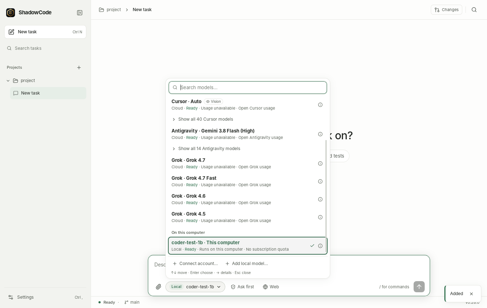
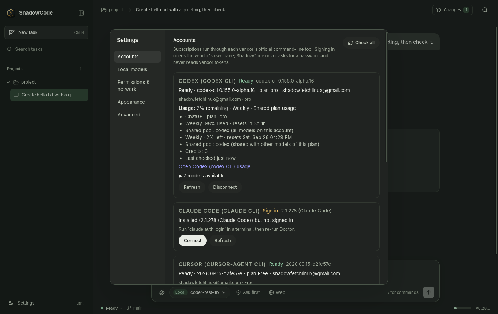
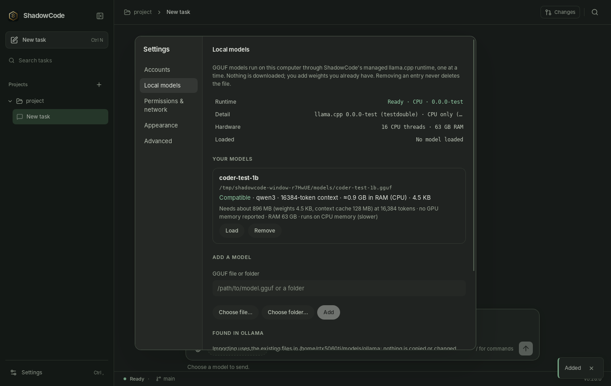

# ShadowCode

ShadowCode is a Linux desktop coding agent. Open a project, pick a model,
describe the change, watch the agent work, then review the diff.

The model can come from a subscription you already have (Codex, Claude Code,
Cursor, Antigravity or Grok, driven through each vendor's own command-line
tool), from an [OpenRouter](https://openrouter.ai) API key if you have no
subscription (hundreds of models, billed per token), or from a GGUF file on
your computer, run by a llama.cpp runtime that ships with the app. You don't
need Ollama, LM Studio or any other model server.


- **One picker.** The composer lists **Subscriptions**, **On this computer**
  and **API keys** in one menu. Each row shows whether it is ready, whether it
  runs locally or in the cloud, and the usage figures the vendor reports.
- **Usage figures come from the vendor.** If a vendor exposes no usage, the row
  says *Usage unavailable* and gives the reason. ShadowCode never makes up a
  figure.
- **Local models run on your hardware.** A bundled, pinned llama.cpp runs on
  Vulkan GPUs or the CPU. Models already in an Ollama store can be imported by
  reference without copying.
- **You approve actions.** Choose *Ask before actions* or *Allow project edits*.
  Every file change can be reviewed and staged in Git, and edits made by
  ShadowCode's own tools can be rewound.

Release history is in [CHANGELOG.md](CHANGELOG.md). What's new in this release:
[0.31.1 release notes](docs/RELEASE_NOTES.md).

## Install

Releases target x86_64 Linux with glibc 2.39 or newer (Ubuntu 24.04 or later).
Download from [GitHub releases](https://github.com/Shadowfetchapps/ShadowCode/releases/latest):

- `ShadowCode_0.31.1_amd64.AppImage`
- `ShadowCode_0.31.1_amd64.deb`
- `SHA256SUMS`

### AppImage (recommended)

Put the AppImage and `SHA256SUMS` in the same folder, then run the installer
from a checkout of this repository:

```bash
sha256sum --ignore-missing -c SHA256SUMS
git clone https://github.com/Shadowfetchapps/ShadowCode.git
./ShadowCode/scripts/install-appimage.sh ~/Downloads/ShadowCode_0.31.1_amd64.AppImage
```

[`scripts/install-appimage.sh`](scripts/install-appimage.sh):

- refuses the file unless it matches its `SHA256SUMS` entry. Pass
  `--unverified` only if you knowingly want to skip the check.
- starts the new AppImage (`--version`) before replacing anything.
- extracts the bundled llama.cpp runtime (`usr/lib/shadowcode`) and checks it:
  no absolute or dangling symlinks, `COMMIT`, `architectures.txt` and `NOTICES`
  present, and `llama-server --version` reports the pinned commit.
- swaps the runtime into `~/.local/lib/shadowcode` with a rename. The old runtime
  is kept as `~/.local/lib/shadowcode.previous` until the install succeeds and is
  put back if a later step fails.
- installs the AppImage as `~/Applications/ShadowCode.AppImage`, the `shadow`
  and `shadowcode` launchers in `~/.local/bin`, and the desktop entry.
- leaves settings, history and project data alone. It removes older ShadowCode
  AppImages only after a successful install.

To run the AppImage without installing it:
`./ShadowCode_0.31.1_amd64.AppImage --appimage-extract-and-run`. FUSE is not
required.

### Debian package

```bash
sha256sum --ignore-missing -c SHA256SUMS
sudo apt install ./ShadowCode_0.31.1_amd64.deb
```

The deb installs `shadowcode` and the same llama.cpp runtime in
`/usr/lib/shadowcode`. It depends on `git`, `libgomp1` and `libssl3`, and
recommends `libvulkan1`, which is needed for GPU inference.

## First run

1. Choose a project folder. The first time, you are asked to trust it, because
   project instructions, hooks and plugins can influence or run work.
2. Choose a permission mode. *Ask before actions* is the default for new
   installs.
3. Open the picker with `Ctrl+M` or the model button in the composer. Rows that
   aren't ready yet point you to **Settings › Accounts** (sign in) or
   **Settings › Local models** (add a GGUF).

## The picker



The picker has three groups: **Subscriptions**, **On this computer** and **API
keys** (OpenRouter, clearly marked as billed per token). Every row is a
concrete target with a stable ID, for example `cli:cursor:auto`,
`local:gguf:<hash>` or `api:openrouter:qwen/qwen3-coder`. Selecting it applies to the current
conversation, and ShadowCode remembers the choice per conversation. Rows
show:

- **Local** or **Cloud**.
- **Availability**: *Ready*, *Sign in*, *Setup required* or *Unavailable*. A
  row that isn't ready stays visible and tells you why.
- **Vision** if the model and the runtime both accept images.
- **Chat only** if a model has no tool support (a local chat template
  without tool calls, or an OpenRouter model that doesn't list `tools`), so it
  can answer questions but can't read or edit files.
- **Usage**: see below.

Send stays disabled until a ready row is selected. If you switch to a
different provider during a conversation, ShadowCode asks before sending local
content to the cloud. See [the user guide](docs/USER_GUIDE.md#switch-models-mid-conversation).

## Accounts and usage



**Settings › Accounts** checks each vendor CLI with its own documented status
command or protocol handshake. ShadowCode never opens credential files.
**Connect** runs the vendor's official login command and relays the URL or
device code it prints. **Disconnect** runs the vendor's logout command, after a
confirmation, because that signs the CLI out everywhere on this computer. It
then forgets ShadowCode's cached status, stored usage and resumable session IDs
for that vendor.

| Vendor | Runtime ShadowCode starts | Connect runs | Models come from | Image input | Approvals reach ShadowCode | Usage shown |
| --- | --- | --- | --- | --- | --- | --- |
| Codex | `codex app-server` (JSON-RPC) | `codex login` | app-server `model/list` | Yes (`localImage`), per model | Yes: command and file-change requests. Codex runs in its own sandbox (`workspace-write`, or `read-only` for Plan/Review) | Rate-limit windows per quota pool (for example 5-hour and weekly), reset times, plan, and credits only when reported |
| Claude Code | `claude -p --output-format stream-json --input-format stream-json --permission-prompts host` | `claude auth login` | *Default* plus the aliases listed in `claude --help` | Yes (image blocks) | Yes, through `--permission-prompts host`. Claude's own settings can pre-approve tools without asking | *Usage unavailable*: Claude Code exposes no plan usage to other apps |
| Cursor | `cursor-agent acp` (Agent Client Protocol) | `cursor-agent login` | ACP session models, with exact IDs | When ACP `initialize` advertises image support | Yes, through ACP permission requests | *Usage unavailable*: Cursor reports its plan tier, not the remaining allowance |
| Antigravity | Google's ACP agent server `agy_acp_server.par` (installed from Accounts) | Google sign-in through the server's `authenticate` | The `model` config option of the ACP session | Yes (ACP image support) | Yes, through ACP permission requests | *Usage unavailable*: the server reports no plan usage |
| Grok | `grok agent stdio` (ACP) | `grok login` | ACP session models (falls back to `grok models`) | No: ACP reports `image: false` | Yes, through ACP. Grok has no read-only mode, so Plan/Review is not enforced by Grok | *Usage unavailable*: Grok reports per-session tokens only |

- **API keys are never used.** Vendor CLIs start with provider API-key
  variables such as `OPENAI_API_KEY` and `ANTHROPIC_API_KEY` removed from their
  environment, so a subscription turn is never quietly billed per token. If a
  CLI itself is signed in with an API key, its rows say
  *API key login · billed per token* and show no plan usage.
- **Usage is saved.** The last usage snapshot is stored locally and shown as
  *Last checked …* after a restart, until the next check.
- **Plan limits stop the task.** If a vendor reports its plan limit, the task
  stops with *Plan limit reached* and you pick another model. ShadowCode never
  buys credits, redeems resets or turns on overages.

Setup details: [subscriptions](docs/SUBSCRIPTIONS.md).

**Antigravity** runs through Google's official ACP agent server instead of the
`agy` CLI, so it asks ShadowCode before running commands or editing files.
**Install** on its Accounts card downloads the server once (334 MB from
dl.google.com, checksum-verified); **Connect** signs in with Google.
**Disconnect** deletes ShadowCode's private Antigravity sign-in and leaves the
`agy` CLI and the Antigravity app signed in. Details:
[subscriptions](docs/SUBSCRIPTIONS.md#antigravitys-agent-server).

## Allowance and plan limits

The **Allowance** button in the status bar lists every way you can run a
model and how much of it is left: each subscription's reported usage windows
and reset times (or *Usage not reported*), OpenRouter credits left on your
key, and the local models that are ready (no quota). Only reported figures
are shown.

When a subscription reports its plan limit, ShadowCode can keep going on a
local model: the same conversation continues on a model on this computer,
with the usual summary of earlier turns. This is the default; set **When a
plan runs out** to **Ask me** to choose each time. Details:
[user guide](docs/USER_GUIDE.md#when-a-plan-limit-is-reached).

## Compare

**Compare** (next to **Send**) runs one task on 2 or 3 models at once, each
in its own Git worktree that starts from your latest commit plus your
uncommitted work. Your checkout is not touched while they work. The
**Comparisons** view shows the lanes side by side: files changed, checks run,
time and usage, and a link to each lane's conversation. **Keep** one result to
apply its changes to your working tree (nothing is committed); every lane and
its branch is then removed, and **Wins in this project** counts which model
you kept. At most one local model per comparison, since only one fits in GPU
memory. Details: [compare](docs/COMPARE.md).

## Parallel tasks

**Worktree** (next to **Send**, or `Ctrl+Shift+Enter`) starts a task in its
own worktree of the project, so it runs while another task works in your
checkout. When it is done, **Apply to project** (checked with `git apply
--check` first; conflicting files are listed and nothing is written), **Keep
as branch** or **Discard**. The sidebar marks conversations that are running,
need your approval, failed or finished while you were elsewhere; desktop
notifications cover the same, and clicking one opens its conversation. The
chip in the status bar shows context use and cost, e.g.
`42% · 38k / 128k · $0.12`. Details:
[user guide](docs/USER_GUIDE.md#run-tasks-side-by-side).

## API keys (OpenRouter)

No subscription? Create a key at [openrouter.ai/keys](https://openrouter.ai/keys)
and paste it into **Settings › Accounts › OpenRouter**. ShadowCode checks it
with OpenRouter, stores it only in your profile, and never shows it again. The
picker's **API keys** group then lists OpenRouter's text models, with price
per million tokens, *Vision* when the model accepts images and *Chat only*
when it has no tool support. Search the picker by name or slug to find one.

These models run on ShadowCode's own agent loop, the same one local models
use, so your permission mode, approvals, checkpoints, the **Web** toggle,
image attachments (*Vision* rows) and review all apply. Every token is billed to your OpenRouter account; the Accounts card
shows credits used and your key's limit. Each job and conversation records its
tokens and cost (`/cost`), Claude and Gemini requests use prompt caching, and
rate limits are retried automatically. Details: [OpenRouter](docs/OPENROUTER.md).

## Local models



**Settings › Local models** lists GGUF files you add, either a single file or a
folder. It shows the runtime, the detected hardware and the loaded model.
ShadowCode never downloads weights. Removing a row never deletes the file.

- **Everything is read from the file.** ShadowCode reads the GGUF header for
  architecture, trained context, chat template and tensors, never the file name.
  A model whose architecture the bundled llama.cpp doesn't support is listed as
  incompatible, with the reason.
- **Import from Ollama.** Models in an existing Ollama store can be imported
  by reference: ShadowCode registers the store's blob paths, including any
  vision projector. It never copies the blobs, never writes to the store and
  doesn't need the Ollama daemon. The store is found through `OLLAMA_MODELS`,
  the Ollama systemd user unit, or `~/.ollama/models`.
- **GPU or CPU.** The runtime has a Vulkan module and CPU variants for every
  x86-64 level. When the memory estimate fits in VRAM, all layers go to the GPU.
  When it doesn't, llama.cpp offloads what fits. If the GPU start fails, ShadowCode
  retries once on the CPU and the row says *CPU fallback*. Only one model is
  loaded at a time. The model can't be swapped or unloaded while a task is
  using it.
- **Memory estimate.** Context starts at the lower of the trained context and
  16,384 tokens (`local_engine.context_size`). It is halved until the estimate
  fits in VRAM (1 GiB kept free) or RAM (2 GiB kept free), but not below 4,096
  tokens. The number shown is the context the server actually runs with.
- **Vision.** Only a model with a paired vision projector (mmproj) is marked
  Vision. A projector is paired by file name (`<model>.mmproj.gguf`,
  `<model>-mmproj.gguf`, `mmproj-<model>.gguf`) or when a folder holds exactly
  one model and one projector, and it must match the model's embedding width.
  After loading, the flag comes from what the server reports.
  Vision models also get a `view_image` tool.
- **Chat only.** If the chat template has no tool calling, no tools are sent to
  the model.

The runtime runs `llama-server` on `127.0.0.1` with a new random key for each
launch, passed through its environment. The server's web UI is disabled.
Details: [local models](docs/LOCAL_MODELS.md).

## Web and network

ShadowCode's own agent loop has `web_fetch` and `web_search`. They are offered
only for a task started with web turned on: in the window, the **Web** chip in
the composer, which appears for local rows. Vendor CLIs use their own web
tools. Web access refuses loopback, private, link-local and metadata
addresses, CGNAT, multicast and non-standard ports. It re-checks every
redirect and caps time and size.
`web_search` uses DuckDuckGo's HTML page. DuckDuckGo often answers automated
requests with a bot check; ShadowCode then asks
[Marginalia Search](https://www.marginalia.nu/)'s public API, a keyless API
for programs (an independent index, so results lean toward smaller sites). If
both fail, the tool says no results were retrieved and never makes any up. If
you run your own [SearXNG](https://docs.searxng.org/) instance, set
`network.searxng_url` (for example `http://localhost:8888`, with `json`
enabled under `search.formats`) and `web_search` asks it first.
`web_fetch` works independently of search.

**Settings › Permissions & network** has three network modes:

| Mode | Effect |
| --- | --- |
| Online | Everything allowed by other settings |
| Web tools off | ShadowCode's own agent loop gets no web tools. Subscriptions still work |
| Offline | Only models on this computer run. Cloud rows are unavailable, and no vendor process is started for status, models or usage |

## Permissions

| Mode | ShadowCode's own tools (local and OpenRouter models) |
| --- | --- |
| Ask before actions | File edits and shell commands wait for your approval |
| Allow project edits | File edits inside the project run without asking. Shell commands, deletes and Git history changes still ask |

These rules apply to ShadowCode's own tools. Privileged commands (`sudo`, `su`,
`pkexec`, `doas`, `run0`) are blocked unless you allow them, and then they
still ask. Destructive Git commands ask. Edits outside the project are refused.
Plan and Review tasks are read-only.

Vendor CLIs enforce their own sandbox. ShadowCode shows the approval requests
they send and denies them automatically in read-only tasks. Each vendor
decides which of its actions ask; the table above shows how its requests reach
ShadowCode.

Shell commands run as your Linux user. **ShadowCode is not an operating-system
sandbox.** See [SECURITY.md](SECURITY.md).

## Data locations

| What | Where |
| --- | --- |
| Settings | `~/.config/shadow-agent/config.yaml` ([example](config.example.yaml)) |
| Secrets for HTTP providers, including the OpenRouter key (`OPENROUTER_API_KEY`) | `~/.config/shadow-agent/secrets.env` (mode 600) |
| Conversations, jobs, events, goals, usage snapshots | `~/.local/state/shadow-agent/shadow-agent.db` (SQLite, schema version 25; backed up as `shadow-agent.pre-native-<id>.sqlite` before a migration) |
| OpenRouter model list (cache) | `~/.local/state/shadow-agent/openrouter-models.json` |
| Webview storage | `~/.local/share/shadow-agent/webview` |
| llama.cpp runtime (AppImage install) | `~/.local/lib/shadowcode` |
| Antigravity agent server (installed from Accounts) | `~/.local/share/shadowcode/antigravity-acp/1.2.1` |
| Antigravity sign-in (ShadowCode's private profile) | `~/.local/share/shadowcode/antigravity-acp/profile` |
| Project notes, skills, attachments | `<project>/.shadow/` |

The directories are still named `shadow-agent` for compatibility. `--profile
DIR` keeps a separate set, for example for development. The Antigravity
directories follow `XDG_DATA_HOME` and are shared by all profiles.

## Build from source

Requirements: Rust 1.95, Node.js 22.12 or newer, and on Ubuntu 24.04:

```bash
sudo apt-get install build-essential pkg-config libgtk-3-dev \
  libwebkit2gtk-4.1-dev librsvg2-dev libayatana-appindicator3-dev patchelf
```

```bash
npm --prefix ui ci
npm --prefix ui run build
cargo build -p shadowcode-desktop --locked
./target/debug/shadowcode --profile /tmp/shadowcode-dev --workspace /path/to/project
```

Local models also need the managed llama.cpp runtime.
[`scripts/build-llama.cpp.sh`](scripts/build-llama.cpp.sh) builds the commit
pinned in [`tools/llama.cpp.pin`](tools/llama.cpp.pin) without root. It writes
`packaging/llama.cpp/bin` and, unless you pass `--no-user-install`, installs to
`~/.local/lib/shadowcode`.

- **Toolchain:** `git`, a C/C++ compiler and `cmake`. For cmake, the script
  uses `SHADOWCODE_CMAKE`, then `.venv/bin/cmake` in this checkout, then
  `cmake` on `PATH`. `ninja` is used if present.
- **Vulkan module:** needs the `libvulkan-dev` headers and a `glslc` shader
  compiler. `tools/glslc-flatpak.sh` looks for `SHADOWCODE_GLSLC`, then
  `glslc` on `PATH` (Ubuntu package `glslc`), then the compiler inside a
  user-installed `org.freedesktop.Sdk` flatpak runtime. SPIRV-Headers is
  fetched automatically at the pinned commit. If glslc or the Vulkan headers
  are missing, the script builds a CPU-only runtime and prints a warning.
  `--cpu-only` or `SHADOWCODE_LLAMA_VULKAN=0` asks for that explicitly.
- **Licenses:** the license texts of everything compiled in are copied into the
  runtime's `NOTICES/`. `--notices-only` refreshes them without recompiling.

Release packaging is described in [docs/RELEASING.md](docs/RELEASING.md).

## Tests

```bash
cargo +1.95.0 fmt --all --check
cargo +1.95.0 clippy --workspace --all-targets --locked -- -D warnings
cargo +1.95.0 build -p shadowcode-desktop --locked   # process tests launch this binary
cargo +1.95.0 test --workspace --locked
npm --prefix ui run typecheck
npm --prefix ui test
(cd ui && npx playwright install chromium && npm run test:e2e)
node --test scripts/test-llama-runtime.mjs
bash scripts/test-install-appimage.sh
node scripts/check-secrets.mjs
```

The Rust tests use fake vendor CLIs and a fake `llama-server`, so they need no
account or GPU. The Playwright suite runs against `vite preview` of a test
build with a fake engine. `e2e/check-bundle.mjs` checks that the fake engine is
not in the production bundle. `scripts/check-secrets.mjs` fails if a tracked
file looks like it holds a real API key or private key, or if a `.env` or
`secrets.env` file is tracked. See [CONTRIBUTING.md](CONTRIBUTING.md).

Live checks use real accounts and cost a little plan allowance or credit, so
they are not part of the suite. `live_vendor_turn` runs one short real turn
through the same service the window uses, in a throwaway profile and project:

```bash
cargo run -p shadowcode-core --example live_vendor_turn -- <picker id> [--second|--command|--web|--image|--switch <id>]
```

`--second` sends a follow-up to check resume. `--command` asks for one
harmless shell command and approves it through the approval API. `--web`
gives the task web tools (ShadowCode's own loop only). `--image` attaches a
small red PNG. `--switch <id>` continues the conversation on another row and
checks that consent is asked before the handoff. Vendor CLIs keep their own
sign-in; OpenRouter rows read the key from `OPENROUTER_API_KEY`, because the
throwaway profile has no `secrets.env`.

## More

- [User guide](docs/USER_GUIDE.md) · [Architecture](ARCHITECTURE.md) ·
  [Security](SECURITY.md) · [Subscriptions](docs/SUBSCRIPTIONS.md) ·
  [Local models](docs/LOCAL_MODELS.md)
- Advanced features (skills, goals, background processes, MCP, plugins, hooks,
  worktrees, Guardian) are under **Settings › Advanced**. The same executable
  also has a CLI (`shadowcode run`, `shadowcode tui`, `shadowcode mcp serve`):
  [native CLI](docs/NATIVE_CLI.md), [terminal UI](docs/NATIVE_TUI.md),
  [MCP](docs/NATIVE_MCP.md).
- Package notices: [licenses/native](licenses/native/README.md).

## License

ShadowCode is licensed under the [Apache License 2.0](LICENSE) · Copyright
2026 Shadowfetch. If you share a copy or a modified version, include the
[NOTICE](NOTICE) file, which credits Shadowfetch as ShadowCode's original
creator, and mark the files you changed. The license doesn't grant use of
the ShadowCode name for other products. Releases up to 0.31.0 were
published under the MIT License.
