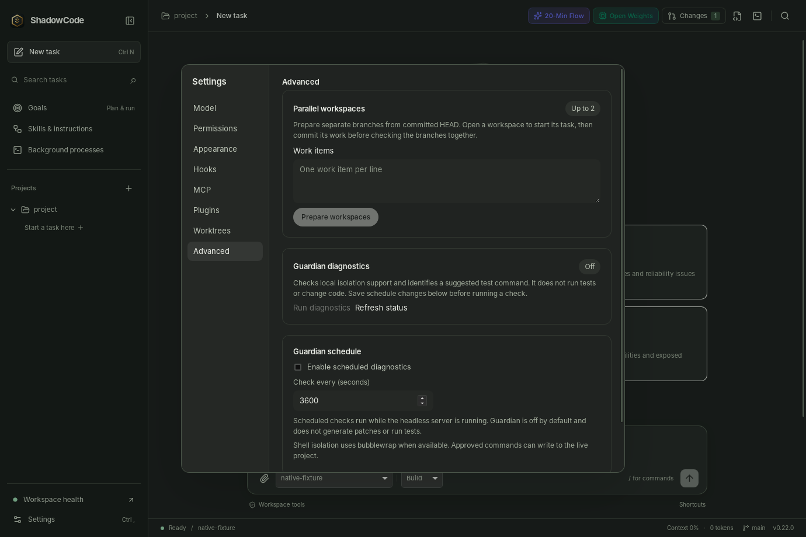

# Parallel workspaces

> **Advanced.** In 0.28 this is reached through Settings › Advanced › Worktrees. For the everyday workflow see the [user guide](USER_GUIDE.md), [subscriptions](SUBSCRIPTIONS.md) and [local models](LOCAL_MODELS.md).

Settings › Advanced prepares up to two Git worktrees for separate work items.
Each starts from committed HEAD. Uncommitted lead edits stay in the source
checkout. Open each workspace to start a task explicitly; preparation does not
launch model workers or choose models.

Plans are saved per source workspace in the current profile and survive an app
restart. Finish and commit each worker's changes, then mark it finished and use
**Check integration**. The check combines workers in order against the current
lead HEAD, including conflicts between workers. It writes temporary Git objects
but changes no branch, index or working file. A clean check does not mean tests
passed and does not merge the branches.

**Remove clean checkouts** refuses running workers, tracked changes, untracked
files and ignored files. It retains all worker branches and commits for later
review or integration. The lead checkout stays intact. Trust, writable mode and
idle-workspace reservations apply to mutating operations. Configured checkout
filters and merge drivers cannot run through these operations; repositories
requiring them may need manual handling. A checkout deleted outside ShadowCode
is named in the integration-check error; cleanup prunes its stale Git record,
lists it under `missing_checkouts` and still retains its branch, so the plan can
always be cleared and replaced.

The feature is disabled outside Git and requires opening the repository root.
Two prepared worktrees do not imply two models will fit in GPU memory.

APIs: `GET /api/parallel`, `POST /api/parallel/prepare` (`goal`),
`POST /api/parallel/worker-status` (`worker_id`, `status`),
`POST /api/parallel/verify`, `POST /api/parallel/cleanup`.
